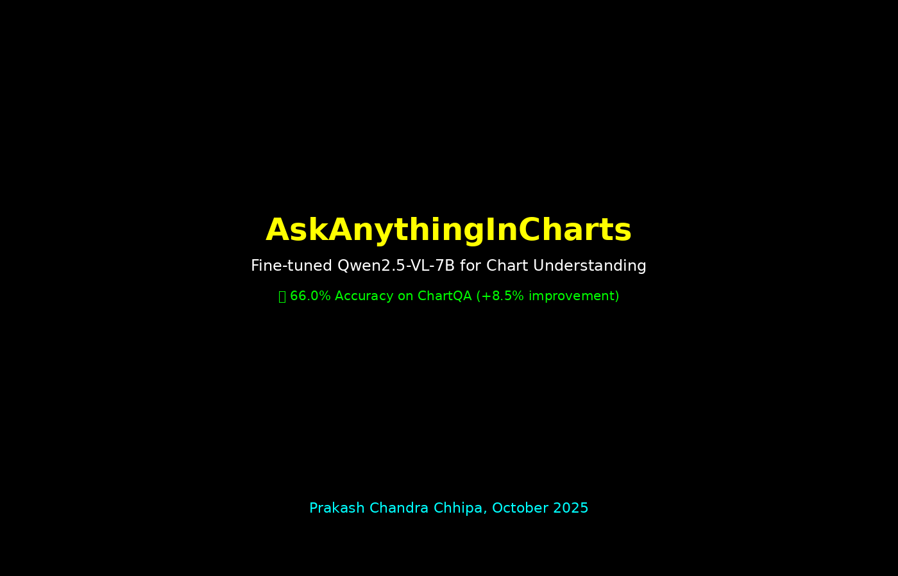

# AskAnything in Charts - Powered by Qwen 2.5

LORA Fine-tuned Qwen 2.5 7B vision-language model with the base model for chart understanding tasks. Finetuned adapted for pinpoint answer for question on ChartQA benchmark, acheiving 8% improvmeent. The model is trained on the ChartQA dataset to better understand and answer questions about charts and graphs.

**Author:** [Prakash Chandra Chhipa](https://github.com/prakashchhipa)  
**Portfolio:** [prakashchhipa.github.io](https://prakashchhipa.github.io)  
**GitHub:** [AskAnythingInCharts-Qwen2.5-7B](https://github.com/prakashchhipa/AskAnythingInCharts-Qwen2.5-7B)

## 🚀 Try It Live

- **🎨 Interactive Demo:** [HuggingFace Spaces](https://huggingface.co/spaces/prakashchhipa/chart-qa-demo-qwen2.5)
- **🤗 Model Card:** [HuggingFace Hub](https://huggingface.co/prakashchhipa/Qwen2.5-VL-7B-ChartQA-LoRA)

## 🎬 Demo

### Animated Demo


<p align="center">
  
  
  
  
</p>

<p align="center">
  <a href="https://huggingface.co/spaces/prakashchhipa/chart-qa-demo-qwen2.5">
    
  </a>
  <a href="https://huggingface.co/prakashchhipa/Qwen2.5-VL-7B-ChartQA-LoRA">
    
  </a>
</p>

---

## 🎯 Performance Comparison

| Model | ChartQA Accuracy | Improvement |
|-------|------------------|-------------|
| Qwen 2.5 7B | **57.5%** | - |
| **Qwen 2.5 7B + LORA SFT** | **66.0%** | **+8.5%** |

---

---

## 🚀 Try It Yourself

### Option 1: Online Demo (HuggingFace Spaces)

- **🎨 Interactive Demo:** [HuggingFace Spaces](https://huggingface.co/spaces/prakashchhipa/chart-qa-demo-qwen2.5)

### Option 2: Run Locally

```bash
# 1. Clone the repository
git clone https://github.com/prakashchhipa/AskAnythingInCharts-Qwen2.5-7B.git
cd AskAnythingInCharts-Qwen2.5-7B

# 2. Install dependencies
pip install torch torchvision torchaudio --index-url https://download.pytorch.org/whl/cu121
pip install transformers datasets accelerate peft trl deepspeed
pip install pillow wandb gradio

# 3. Download ChartQA dataset
# You need to download the ChartQA dataset manually:
# - data/chartqa_train.json (training data)
# - data/images/ (chart images directory)
# Place these in the project root directory

# 4. Run the Gradio demo
python src/app_gradio.py
```

Open your browser at `http://localhost:7860`

### Option 3: Train Your Own Model

```bash
# 1. Set up environment (same as above)

# 2. Download ChartQA dataset (same as above)

# 3. Run training - cache will be built automatically
bash scripts/run_train_best_r64.sh
```

**Note:** The training script will automatically build the cache directory (`cache/sft_chartqa_textvqa/`) on first run. This may take some time but will speed up subsequent training runs.

### Option 3: Use the Model Directly

```python
from transformers import AutoProcessor, Qwen2_5_VLForConditionalGeneration
from peft import PeftModel
from PIL import Image

# Load model
base_model = Qwen2_5_VLForConditionalGeneration.from_pretrained(
    "Qwen/Qwen2.5-VL-7B-Instruct",
    torch_dtype="bfloat16",
    device_map="auto"
)
model = PeftModel.from_pretrained(base_model, "prakashchhipa/Qwen2.5-VL-7B-ChartQA-LoRA")
model = model.merge_and_unload()

processor = AutoProcessor.from_pretrained("prakashchhipa/Qwen2.5-VL-7B-ChartQA-LoRA")

# Inference
image = Image.open("chart.png")
question = "What is the highest value in the chart?"

messages = [
    {"role": "user", "content": [
        {"type": "text", "text": question},
        {"type": "image", "image": image}
    ]}
]

text = processor.apply_chat_template(messages, tokenize=False, add_generation_prompt=True)
# ... (process vision info and generate)
```

---

## 📊 Data Setup & Cache Management

### Required Data Files

This repository does **NOT** include the training data due to size constraints. You need to download the ChartQA dataset separately:

1. **Download ChartQA Dataset:**
   - Visit the [ChartQA GitHub repository](https://github.com/vis-nlp/ChartQA)
   - Download the training data and images
   - Place them in your project directory:
     ```
     data/
     ├── chartqa_train.json    # Training annotations
     └── images/               # Chart images directory
     ```

2. **Dataset Structure:**
   ```
   data/
   ├── chartqa_train.json      # ~50K training examples
   └── images/                 # Chart images (PNG files)
       ├── train/
       │   ├── 0000.png
       │   ├── 0001.png
       │   └── ...
       └── val/
           ├── 0000.png
           └── ...
   ```

### Cache System

The training script uses a smart caching system to speed up subsequent runs:

- **First Run:** Automatically builds cache in `cache/sft_chartqa_textvqa/`
- **Subsequent Runs:** Uses preprocessed cache for faster training
- **Cache Contents:** Preprocessed datasets, tokenized data, image features
- **Cache Size:** ~2-5GB (excluded from git repository)

**Cache Management:**
```bash
# Rebuild cache (if you want fresh preprocessing)
bash scripts/run_train_best_r64.sh --rebuild_cache

# Clear cache (if you want to start fresh)
rm -rf cache/
```

### Environment Variables

For distributed training, set these environment variables:

```bash
export CUDA_VISIBLE_DEVICES=0,1,2,3,4,5,6,7
export NCCL_DEBUG=WARN
export NCCL_NVLS_ENABLE=0
export NCCL_IB_DISABLE=1
export NCCL_P2P_DISABLE=1
```

---

## 📖 What's Improved?

The fine-tuned model shows better performance in:

| Category | Description |
|----------|-------------|
| ✅ **Concise Answers** | Returns exact values without verbose explanations |
| ✅ **Label Recognition** | Better at reading text labels from charts |
| ✅ **Color Identification** | More accurate at identifying chart colors |
| ✅ **Statistical Calculations** | Improved at medians, ratios, differences |
| ✅ **Counting** | Better accuracy in counting chart elements |
| ✅ **Region Comparison** | Accurate comparisons across chart regions |
| ✅ **Yes/No Questions** | More reliable binary responses |

---

## 🛠️ Technical Details

### Model Architecture
- **Base Model**: [Qwen/Qwen2.5-VL-7B-Instruct](https://huggingface.co/Qwen/Qwen2.5-VL-7B-Instruct) (7B parameters)
- **Fine-tuning Method**: LoRA (Low-Rank Adaptation)
  - Rank: 64
  - Alpha: 16
  - Target modules: Vision and language attention layers

### Training Setup
- **Dataset**: ChartQA (chart understanding benchmark)
- **Training Samples**: ~50-200 samples per epoch
- **Epochs**: 6
- **Learning Rate**: 4e-5
- **LoRA Rank**: 64
- **LoRA Alpha**: 16
- **Hardware**: GPU with 16GB+ VRAM
- **Framework**: HuggingFace Transformers + PEFT + DeepSpeed

### Evaluation
- **Test Set**: ChartQA validation set (500 examples)
- **Metric**: Exact Match (with normalization and numeric tolerance)
- **Filtering**: Only genuine improvements (excluded verbose-but-correct cases)

---

## 📁 Repository Structure

```
AskAnythingInCharts-Qwen2.5-7B/
├── src/                                # Source code
│   ├── train_vlm_sft.py               # Main training script
│   ├── datasets_build.py              # Dataset building utilities
│   ├── app_gradio.py                  # Gradio demo interface
│   ├── agent_infer.py                 # Inference agent
│   ├── infer_cli.py                   # CLI inference tool
│   ├── export_merge_lora.py           # LoRA export utilities
│   ├── prepare_data.py                # Data preparation
│   └── ocr_tool.py                    # OCR utilities
├── scripts/
│   └── run_train_best_r64.sh          # Training script with best config
├── configs/
│   ├── sft_config_rank64.json         # Training configuration
│   └── ds_zero3.json                  # DeepSpeed configuration
├── evaluations/
│   └── eval_chartqa.py                # Evaluation script
├── find_improved_examples.py          # Find improved examples
├── filter_genuine_improvements.py     # Filter genuine improvements
├── data/                              # Dataset (not included in repo)
│   ├── chartqa_train.json            # Training annotations
│   └── images/                        # Chart images
├── cache/                             # Preprocessed cache (not in repo)
│   └── sft_chartqa_textvqa/          # Cached datasets
├── outputs/                           # Model outputs (not in repo)
│   └── qwen2_5_vl_7b_lora_rank64_e6/ # Trained model weights
└── README.md                          # This file
```

**Note:** `data/`, `cache/`, and `outputs/` directories are excluded from the repository due to size constraints. They will be created automatically when you run the training script.

---

## 🔬 Reproduce Results

### 1. Evaluate on ChartQA

```bash
python evaluations/eval_chartqa.py \
  --base_model Qwen/Qwen2.5-VL-7B-Instruct \
  --adapter prakashchhipa/Qwen2.5-VL-7B-ChartQA-LoRA \
  --limit 500 \
  --compare_both
```

### 2. Find Improved Examples

```bash
python find_improved_examples.py \
  --base_model Qwen/Qwen2.5-VL-7B-Instruct \
  --adapter prakashchhipa/Qwen2.5-VL-7B-ChartQA-LoRA \
  --limit 500 \
  --output_dir demo_chatqa
```

### 3. Filter Genuine Improvements

```bash
python filter_genuine_improvements.py \
  --input_dir demo_chatqa/improved \
  --output_dir demo_genuine
```

---

## 📦 Deploy to HuggingFace Spaces

### Step 1: Prepare Files

```bash
# Create a new directory for HF Space
mkdir chartqa-demo
cd chartqa-demo

# Copy necessary files
cp app.py requirements_demo.txt README_DEMO.md .
cp -r demo_genuine/ .

# Upload your adapter to HuggingFace Hub first, then update app.py:
# ADAPTER_PATH = "your-username/your-adapter-name"
```

### Step 2: Create HF Space

1. Go to [HuggingFace Spaces](https://huggingface.co/spaces)
2. Click "Create new Space"
3. Choose "Gradio" as SDK
4. Upload your files
5. Add `.env` file with model paths (if needed)

### Step 3: Space Configuration

Create `README.md` in your Space with:

```yaml
---
title: Chart Understanding with Fine-tuned Qwen2.5-VL
emoji: 📊
colorFrom: blue
colorTo: green
sdk: gradio
sdk_version: 4.0.0
app_file: app.py
pinned: false
---
```

---

## 💡 Use Cases

This model is useful for:

- 📈 **Business Analytics**: Extract insights from business charts
- 📊 **Data Analysis**: Answer questions about data visualizations
- 📑 **Report Processing**: Understand charts in documents
- 🔬 **Research**: Analyze scientific plots and graphs
- 📱 **Accessibility**: Make charts accessible through Q&A
- 🤖 **Automation**: Automate chart data extraction

---

## ⚙️ Requirements

```txt
gradio>=4.0.0
torch>=2.0.0
transformers>=4.45.0
peft>=0.12.0
Pillow>=10.0.0
qwen-vl-utils>=0.0.8
accelerate>=0.20.0
```

**Hardware:**
- **Inference**: GPU with 16GB+ VRAM (or CPU with patience)
- **Training**: GPU with 24GB+ VRAM recommended

---

## 🤝 Contributing

Contributions are welcome! Areas for improvement:

- [ ] Add more chart types (scatter plots, heatmaps, etc.)
- [ ] Improve training data diversity
- [ ] Optimize inference speed
- [ ] Add multi-turn conversation support
- [ ] Create mobile-friendly interface

---

## 📄 License

This project is released under the MIT License. The base Qwen2.5-VL model is subject to its own license terms.

---

## 🙏 Acknowledgments

- **Base Model**: [Qwen Team](https://github.com/QwenLM/Qwen2-VL) for Qwen2.5-VL-7B
- **Dataset**: [ChartQA](https://github.com/vis-nlp/ChartQA) benchmark
- **Framework**: [HuggingFace](https://huggingface.co/) Transformers and PEFT
- **UI**: [Gradio](https://gradio.app/) for the interactive interface

---

## 📚 Citation

If you use this model or code in your research, please cite:

```bibtex
@misc{chartqa-finetuned-qwen,
  title={Fine-tuned Qwen2.5-VL-7B for Chart Understanding},
  author={[Your Name]},
  year={2025},
  url={[Your Repo URL]}
}
```

---

## 📧 Contact

For questions or feedback:
- Open an issue on GitHub

---

<p align="center">
  <b>Built with ❤️ using Qwen2.5-VL and HuggingFace Transformers</b>
</p>

